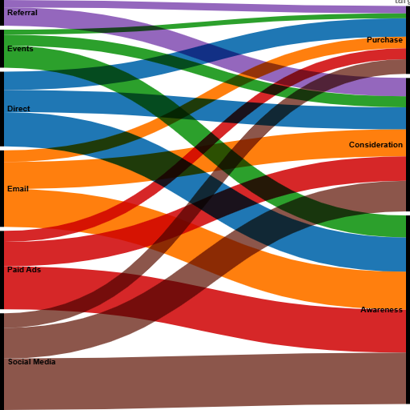

# Customer Journey Alluvial Diagram

This repository contains an Alluvial Diagram created using RAWGraphs to visualize the flow of customers across different stages: Awareness → Consideration → Purchase.

## Visualization
The diagram shows how customers move from different channels (Social Media, Email, Direct, Referral, Paid Ads, Events) through the journey.

- Data: 15–20 rows of realistic source-target-value
- Chart Type: Alluvial Diagram
- Tool: RAWGraphs
- Export: PNG (512x512 pixels)

## Verification
Email: 24f1001581@ds.study.iitm.ac.in
